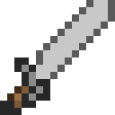
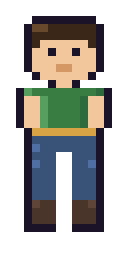
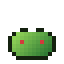
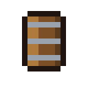
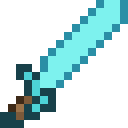
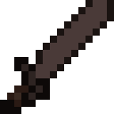

# Pixel Sprite Generator

Generate square pixel-art sprites for 2D games from semantic JSON grids and color palettes.
Deterministic and self-contained -- it renders real PNGs with Pillow; there is no external
image model.

Author: MisterVitoPro

## Showcase

Every sprite below was authored as a JSON grid and rendered by the bundled converter -- no
external image model. Sizes fit the subject the way real games do: the props are 16x16 tiles,
the character is **16x32** (a standing person needs the vertical room -- 16x16 reads as
squished). The shape and palette sources live in [`examples/showcase/`](examples/showcase)
(previews are nearest-neighbor upscales of the real PNGs).

| Weapon | Character | Environment | | |
|:---:|:---:|:---:|:---:|:---:|
|  |  |  |  |  |
| greatsword | hero | tree | bush | barrel |

**One grid, many materials.** A single shape's `outputs` map can name several palettes, so the
greatsword renders straight to iron, diamond, and netherite from the *same* grid -- no redrawing:

| iron | diamond | netherite |
|:---:|:---:|:---:|
|  |  |  |

Reproduce them from the repo root with:

```sh
cd examples/showcase
python "${CLAUDE_PLUGIN_ROOT}/scripts/render_sprites.py"
```

## Spritesheet + atlas packing (`--pack`)

Real 2D games (Stardew Valley, Terraria, Cave Story) never ship one PNG per sprite -- they ship a
single packed **spritesheet** plus a **metadata atlas** mapping named regions to rects. Add
`--pack` and the renderer emits exactly that next to the individual PNGs:

```sh
python "${CLAUDE_PLUGIN_ROOT}/scripts/render_sprites.py" --pack
```

The showcase set packs into one `spritesheet.png` plus a `spritesheet.json` **TexturePacker /
Aseprite-compatible atlas** that loads as-is in Phaser, PixiJS, Godot, and Unity. Uniform sprites
go on a tidy grid; mixed sizes (the 16x32 hero next to 16x16 props) are shelf-packed, and every
frame records its true rect:


```json
{
  "frames": {
    "barrel":     { "frame": {"x": 0, "y": 0, "w": 16, "h": 16}, "sourceSize": {"w": 16, "h": 16}, "duration": 100 },
    "greatsword": { "frame": {"x": 0, "y": 16, "w": 16, "h": 16}, "sourceSize": {"w": 16, "h": 16}, "duration": 100 },
    "hero":       { "frame": {"x": 16, "y": 32, "w": 16, "h": 32}, "sourceSize": {"w": 16, "h": 32}, "duration": 100 }
  },
  "meta": { "app": "pixel-sprite-generator", "image": "spritesheet.png",
            "format": "RGBA8888", "size": {"w": 32, "h": 80}, "frameTags": [] }
}
```

Name a shape's outputs `walk_f0`, `walk_f1`, ... and the packer auto-groups them into an Aseprite
`frameTags` animation entry. Flags: `--pack-name <basename>`, `--pack-cols <n>`.

## What you get

- **Skill** `pixel-sprite-generator` -- how to author shape grids + palettes and render them.
- **Command** `/pixel-sprite-generator:init` -- scaffold a project (config, dirs, worked example).
- **Renderer** `scripts/render_sprites.py` -- config-driven JSON-grid -> PNG converter, with
  `--pack` for a TexturePacker/Aseprite-compatible spritesheet + atlas.
- **Templates** -- a default config plus an example gem sprite + palette.

## Requirements

- Python 3
- Pillow: `pip install Pillow`

## Quick start

1. Install this plugin's marketplace and enable the plugin (see the marketplace README).
2. In your game project, run `/pixel-sprite-generator:init` to create `pixel-sprite.config.json`,
   the `art/shapes` and `art/palettes` directories, an `assets/sprites` output directory, and a
   worked example.
3. Render the example: `python "${CLAUDE_PLUGIN_ROOT}/scripts/render_sprites.py" --only gem`
4. Ask Claude to "generate the <id> sprite" -- the skill authors the grid and renders the PNG.

## Configuration (`pixel-sprite.config.json`)

```json
{
  "size": 16,
  "shapes_dir": "art/shapes",
  "palettes_dir": "art/palettes",
  "out_dir": "assets/sprites"
}
```

`size` is the project default and must be a power of two (8, 16, 32, 64, ...). Individual shapes
can override it with their own `width`/`height` (each a power of two) for non-square sprites like
a 16x32 character. Every CLI flag (`--size`, `--shapes-dir`,
`--palettes-dir`, `--out-dir`, `--config`) overrides the file for a single run. Use `--check` to
validate all shapes and palettes without writing, and `--pack` to also emit a packed spritesheet
+ JSON atlas (see above).
