# Pixel Sprite Generator

Generate pixel-art sprites for 2D games using a local image model as the primary path, with a
deterministic JSON-grid renderer as the fallback. Configuration lives in
`pixel-sprite.config.yaml` at the project root.

Author: MisterVitoPro

## How it works

The default path sends a prompt to **the configured backend**, post-processes the result into
a small RGBA PNG, and writes it to your output directory. When the backend is unreachable the
script exits with code 3 so CI pipelines can detect the failure cleanly. Pass `--fallback-grid`
to render the sprite from a hand-authored JSON grid instead of failing, or `--mode grid` to
always use the grid renderer.

```
art/sprites/<id>.yaml   ->  image model  ->  post-process  ->  assets/sprites/<id>.png
                                                     |
                                          backend unavailable?
                                            exit 3  (or --fallback-grid -> grid path)
art/shapes/<id>.json    ->  grid renderer ->                ->  assets/sprites/<id>.png
```

## Image-first flow

1. Author a sprite spec at `art/sprites/<id>.yaml`:

   ```yaml
   id: hero
   subject: "a standing RPG hero, helmet, sword"
   gen:
     seed: 42
   outputs:
     hero: {}
     hero_dark:
       recolor: hero_dark
   ```

2. Run the renderer:

   ```sh
   python "${CLAUDE_PLUGIN_ROOT}/scripts/render_sprites.py" --only hero
   ```

3. The renderer builds a prompt from the spec and your config's `prompt` template, calls the
   local image endpoint, and post-processes the result.

4. To render all specs at once, omit `--only`:

   ```sh
   python "${CLAUDE_PLUGIN_ROOT}/scripts/render_sprites.py"
   ```

## Configuration (`pixel-sprite.config.yaml`)

A minimal config:

```yaml
size: 16
mode: auto
sprites_dir: art/sprites
shapes_dir: art/shapes
palettes_dir: art/palettes
out_dir: assets/sprites

backend: openai  # or: a1111, swarmui, or a custom backend block

prompt:
  prefix: "pixel art sprite of"
  suffix: "centered, plain magenta background, crisp pixels, limited palette, no anti-aliasing"
  negative: "blurry, photorealistic, drop shadow, extra limbs, watermark, text"

postprocess:
  downscale: nearest
  background:
    method: chroma
    color: "#FF00FF"
    tolerance: 20
  quantize:
    enabled: true
    colors: 16
    palette: null
  outline: false

pack:
  enabled: false
  name: spritesheet
```

`size` is the project default and must be a power of two (8, 16, 32, 64, ...). Individual
shapes can override it with `width`/`height`. Every CLI flag (`--size`, `--sprites-dir`,
`--palettes-dir`, `--out-dir`, `--config`, `--mode`) overrides the file for a single run.

## Backends

The renderer supports pluggable, config-driven image backends. Configure the backend via the
`backend:` field in `pixel-sprite.config.yaml` (use a preset name or paste a backend block).
Three presets are shipped:

| Preset | Description |
|--------|-------------|
| `openai` | OpenAI-compatible API (OpenAI, local Stable Diffusion server, etc.) |
| `a1111` | Automatic1111 Stable Diffusion WebUI |
| `swarmui` | SwarmUI local image generation server |

Copy a preset from `templates/backends/` into your config, or define a custom backend block:

```yaml
backend:
  prep: |
    # Python code to prepare the request payload (optional)
  request:
    method: POST
    url: ${env:IMAGE_ENDPOINT}
    headers: {}
    auth: ${env:API_KEY}  # Unset env var drops this key
  response:
    kind: auto  # base64 | url | auto
    fetch_base: false  # Fetch URLs and return as base64 if true
    image_key: image  # JSON path to extract the image
```

### Placeholders

Template variables substituted in `backend:` strings:

- `${prompt}` -- positive prompt (assembled from `prompt.prefix`, spec subject, `prompt.suffix`)
- `${negative}` -- negative prompt (from `prompt.negative`)
- `${model}` -- model ID (from spec `gen.model` or default)
- `${gen_width}`, `${gen_height}`, `${gen_size}` -- generation dimensions in pixels
- `${seed}` -- random seed (from spec `gen.seed` or None)
- `${env:NAME}` -- environment variable; unset variables are skipped
- Prep-captured variables -- any Python variable in `prep:` is available as `${var_name}`

### Placeholder rules

- **Type preservation**: `${seed}`, `${gen_width}`, `${gen_height}`, `${gen_size}` remain JSON
  numbers; `${prompt}`, `${negative}`, `${model}` are strings.
- **None-drops-key**: If a placeholder is None or an env var is unset, the entire key is omitted.
  For example, unset `${env:API_KEY}` in `auth:` drops the auth header entirely.
- **Environment-only secrets**: All config keys come from `${env:NAME}` substitution, never from
  the file itself, ensuring secrets stay out of version control.

## Prompt template

The prompt sent to the image model is assembled from three fields in `pixel-sprite.config.yaml`:

```
<prefix> <spec.subject> [<output-level overrides>], <suffix>
negative: <negative>
```

For the default config and a hero spec the positive prompt becomes:

```
pixel art sprite of a standing RPG hero, helmet, sword,
centered, plain magenta background, crisp pixels, limited palette, no anti-aliasing
```

Override `prefix`, `suffix`, or `negative` in the config to tune the house style across all
sprites without touching individual specs.

## Post-processing steps

After the image model returns a raw PNG the renderer applies these steps in order:

1. **Background removal** -- keyed on the plain magenta (`#FF00FF`) background via chroma-key
   (configurable: `chroma`, `alpha_threshold`, or `none`).
2. **Downscale** -- nearest-neighbor (default) or box/lanczos to the target `size`.
3. **Palette quantize** -- reduces to at most `colors` colors (default 16) so the sprite reads
   like pixel art at small sizes. Set `enabled: false` to skip.
4. **Outline** (optional) -- adds a 1-pixel dark outline around opaque regions when
   `outline: true`.
5. **Recolor** (per output) -- when an output entry specifies `recolor: <palette_name>` the
   post-processed base image is palette-swapped against the named JSON palette instead of being
   regenerated, making material variants cheap.

## Fallback contract (exit code 3 / `--fallback-grid`)

When the image backend is unreachable the script exits with **code 3**. Use this to detect
backend failures in CI or automation without confusing them with validation errors (code 1) or
environment/config errors (code 2).

```sh
python "${CLAUDE_PLUGIN_ROOT}/scripts/render_sprites.py"
# exit 3 if backend down; exit 1 on bad config; exit 0 on success
```

Pass `--fallback-grid` to silently switch to the deterministic grid renderer for any sprite
that fails to generate:

```sh
python "${CLAUDE_PLUGIN_ROOT}/scripts/render_sprites.py" --fallback-grid
```

Force the grid renderer for the entire run with `--mode grid`.

## Requirements

- Python 3
- Pillow and PyYAML: `pip install Pillow PyYAML`

## Showcase

Every sprite below was rendered with `--mode grid` from a hand-authored JSON grid -- the
deterministic JSON-data path, no external image model. The four subjects are authored at **both
32x32 and 16x16**, applying small-sprite craft from acclaimed pixel art: a single top-left light
source, **hue-shifted color ramps** (shadows cooler/desaturated, mids most saturated, lights
warmer), silhouette-first readability, selective outlining, a lobed (clustered) tree canopy, and
dithered wall texture. The showcase config also wires in the **SwarmUI** backend, so the same
subjects can be regenerated through the image model with `--mode image` once a SwarmUI server is
running. Sources live in [`examples/showcase/`](examples/showcase) (previews are nearest-neighbor
upscales of the real PNGs).

**32x32:**

| Character | Battleaxe | Tree | Building |
|:---:|:---:|:---:|:---:|
| 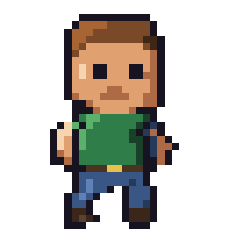 | 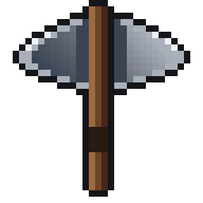 | 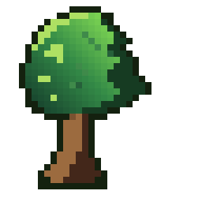 | 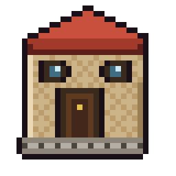 |

**16x16** (same subjects, tightened to the classic small-sprite constraint):

| Character | Battleaxe | Tree | Building |
|:---:|:---:|:---:|:---:|
| 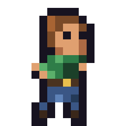 | 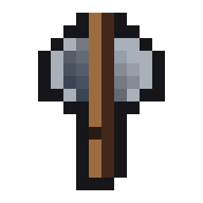 | 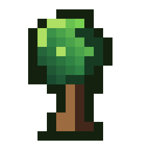 | 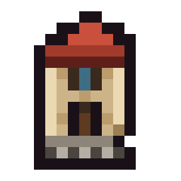 |

**One grid, many materials.** A single shape's `outputs` map can name several palettes, so the
battleaxe renders straight to iron, diamond, and netherite from the *same* grid -- no redrawing.
Each material is a hue-shifted 4-stop ramp (deep shadow, mid, light, specular):

| iron | diamond | netherite |
|:---:|:---:|:---:|
|  | 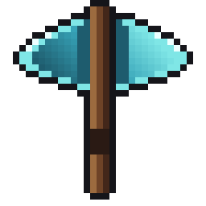 | 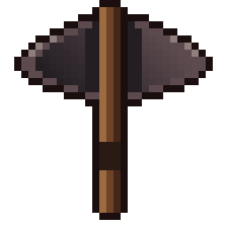 |

Reproduce them from the repo root with:

```sh
cd examples/showcase
python "${CLAUDE_PLUGIN_ROOT}/scripts/render_sprites.py" --mode grid
```

To regenerate the same set through the SwarmUI image model instead (server running on
`127.0.0.1:7801`), swap the path:

```sh
cd examples/showcase
python "${CLAUDE_PLUGIN_ROOT}/scripts/render_sprites.py" --mode image
```

## Spritesheet + atlas packing (`--pack`)

Real 2D games (Stardew Valley, Terraria, Cave Story) never ship one PNG per sprite -- they ship a
single packed **spritesheet** plus a **metadata atlas** mapping named regions to rects. Add
`--pack` and the renderer emits exactly that next to the individual PNGs:

```sh
python "${CLAUDE_PLUGIN_ROOT}/scripts/render_sprites.py" --pack
```

The showcase set packs into one `spritesheet.png` plus a `spritesheet.json` **TexturePacker /
Aseprite-compatible atlas** that loads as-is in Phaser, PixiJS, Godot, and Unity. The twelve
frames mix sizes (32x32 subjects, the battleaxe in three materials, plus their 16x16 variants),
so they are deterministically shelf-packed and every frame records its true rect:

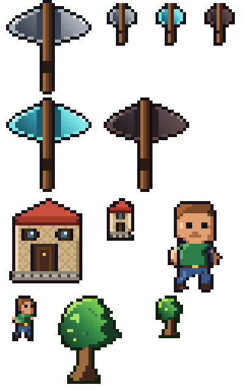

```json
{
  "frames": {
    "battleaxe":   { "frame": {"x": 0,  "y": 0,  "w": 32, "h": 32}, "sourceSize": {"w": 32, "h": 32}, "duration": 100 },
    "battleaxe16": { "frame": {"x": 32, "y": 0,  "w": 16, "h": 16}, "sourceSize": {"w": 16, "h": 16}, "duration": 100 },
    "character":   { "frame": {"x": 48, "y": 64, "w": 32, "h": 32}, "sourceSize": {"w": 32, "h": 32}, "duration": 100 }
  },
  "meta": { "app": "pixel-sprite-generator", "image": "spritesheet.png",
            "format": "RGBA8888", "size": {"w": 80, "h": 128}, "frameTags": [] }
}
```

Name a shape's outputs `walk_f0`, `walk_f1`, ... and the packer auto-groups them into an Aseprite
`frameTags` animation entry. Flags: `--pack-name <basename>`, `--pack-cols <n>`.

## What you get

- **Skill** `pixel-sprite-generator` -- how to author sprite specs + shape grids + palettes and render them.
- **Command** `/pixel-sprite-generator:init` -- scaffold a project (config, dirs, worked example).
- **Renderer** `scripts/render_sprites.py` -- local image model first; deterministic JSON-grid as fallback;
  `--pack` for a TexturePacker/Aseprite-compatible spritesheet + atlas.
- **Templates** -- a default `pixel-sprite.config.yaml` plus an example gem sprite + palette.

## Quick start

1. Install this plugin's marketplace and enable the plugin (see the marketplace README).
2. In your game project, run `/pixel-sprite-generator:init` to create `pixel-sprite.config.yaml`,
   the `art/sprites`, `art/shapes`, and `art/palettes` directories, an `assets/sprites` output
   directory, and a worked example.
3. Start your local image model server and point the `backend:` block in the config at it (or
   copy a preset from `templates/backends/`); see the [Backends](#backends) section.
4. Render the example: `python "${CLAUDE_PLUGIN_ROOT}/scripts/render_sprites.py" --only gem`
5. Ask Claude to "generate the <id> sprite" -- the skill authors the spec and renders the PNG.
